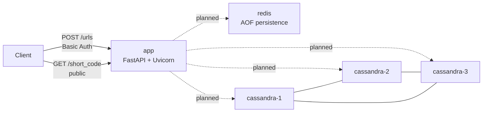
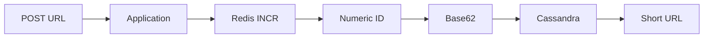
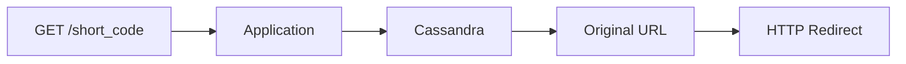

# url-shortener

A URL shortening service built to explore backend engineering, distributed storage, and system design decisions in a practical portfolio project.

The current milestone provides a Docker-first development environment and a minimal FastAPI HTTP skeleton. It does not implement real URL creation, redirects, Base62 encoding, Cassandra tables, Redis ID generation, or business rules yet.

## Current Status

Implemented:

- Docker-first development environment.
- Multi-stage Python 3.14 application image with `uv` available inside the container.
- Minimal FastAPI application running inside Docker with Uvicorn.
- `POST /urls` route skeleton protected by HTTP Basic Authentication.
- `GET /{short_code}` public route skeleton.
- Automatic OpenAPI documentation generated by FastAPI.
- Minimal HTTP skeleton tests executed through Docker.
- Redis service with persistence enabled through AOF and a dedicated Docker volume.
- Three-node Apache Cassandra cluster for local study.
- Dedicated Docker volumes for each Cassandra node.
- Docker network for service-to-service communication by DNS name.
- Health checks for the HTTP application, Redis, and Cassandra.
- English and Portuguese architecture and Docker documentation.

Planned:

- Real URL creation behavior.
- URL resolution lookup and HTTP redirect.
- Redis `INCR`-based numeric ID generation.
- Base62 short code generation.
- Cassandra keyspace, tables, and query model.
- Definitive request/response contracts.
- Linters and formatters.

## Technology Stack

- Python 3.14
- `uv`
- FastAPI
- Uvicorn
- Pytest
- Docker and Docker Compose
- Redis 7
- Apache Cassandra 5.0

The host machine should mainly provide Git, Docker, and Docker Compose. Python, `uv`, Redis, Cassandra, and project-specific tools are provided by containers.

## Architecture

Current local infrastructure:



Future write flow:



Future read flow:



Cassandra is configured as a peer-to-peer cluster. `cassandra-1` is used as the seed node for discovery, but it is not a leader, primary, master, or read replica.

The current HTTP routes return explicit `501 Not Implemented` placeholders. Redis and Cassandra are available in the infrastructure but are not used by the routes yet.

## Development Environment

Copy the public environment contract before starting the stack:

```sh
cp .env.example .env
```

The real `.env` file is local only, ignored by Git, and consumed by Docker Compose through environment interpolation. Do not commit it.

Configure `BASIC_AUTH_USERNAME` and `BASIC_AUTH_PASSWORD` in the local `.env` before exercising `POST /urls`. Keep real values private.

Build the application image:

```sh
docker compose build
```

Start the full local environment:

```sh
docker compose up -d
```

The API is available at:

```text
http://localhost:8000
```

OpenAPI is available at:

```text
http://localhost:8000/docs
```

Check service health:

```sh
docker compose ps
```

Run Python through the application container:

```sh
docker compose run --rm --no-deps app python --version
```

Run `uv` through the application container:

```sh
docker compose run --rm --no-deps app uv --version
```

Run tests through Docker:

```sh
docker compose run --rm --no-deps app uv run pytest
```

Open a shell in the application container:

```sh
docker compose run --rm --no-deps app sh
```

Check the public placeholder route:

```sh
curl -i http://localhost:8000/abc123
```

Check that `POST /urls` requires Basic Auth:

```sh
curl -i -X POST http://localhost:8000/urls -H 'Content-Type: application/json' -d '{"url":"https://example.com"}'
```

Check the authenticated placeholder using local private credentials:

```sh
curl -i -u "$BASIC_AUTH_USERNAME:$BASIC_AUTH_PASSWORD" -X POST http://localhost:8000/urls -H 'Content-Type: application/json' -d '{"url":"https://example.com"}'
```

Check Redis:

```sh
docker compose exec redis sh -c 'if [ -n "$REDIS_PASSWORD" ]; then REDISCLI_AUTH="$REDIS_PASSWORD" redis-cli ping; else redis-cli ping; fi'
```

Check Cassandra CQL readiness:

```sh
docker compose exec cassandra-1 cqlsh 127.0.0.1 9042 -e "DESCRIBE KEYSPACES;"
```

Check Cassandra cluster membership:

```sh
docker compose exec cassandra-1 nodetool status
```

Stop the environment:

```sh
docker compose down
```

Remove containers and local volumes only when you intentionally want to delete Redis and Cassandra data:

```sh
docker compose down --volumes
```

## Documentation

- [Architecture](docs/en/architecture.md)
- [Docker development](docs/en/docker.md)
- [Arquitetura em português](docs/pt-BR/architecture.md)
- [Docker em português](docs/pt-BR/docker.md)
