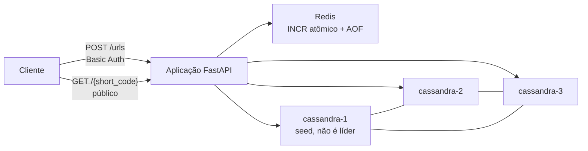

# url-shortener

`url-shortener` é um projeto de portfólio de Backend/System Design com abordagem Docker-first que implementa a criação de URLs encurtadas e a resolução pública de redirecionamentos utilizando FastAPI, Redis, Cassandra, codificação Base62 e ofuscação reversível de códigos curtos.

O projeto foi intencionalmente mantido pequeno o suficiente para ser explicado em uma entrevista, ao mesmo tempo em que aborda preocupações reais de backend: operações de escrita autenticadas, leituras públicas, geração atômica de IDs, armazenamento persistente, infraestrutura conteinerizada e testes automatizados.

## Arquitetura

A aplicação é executada como um serviço FastAPI apoiado por Redis e por um cluster Cassandra de três nós.



Fluxo do POST:

```text
POST /urls
  -> Basic Authentication
  -> validação da URL
  -> Redis INCR
  -> ID inteiro
  -> Base62
  -> ofuscação reversível
  -> código público de sete caracteres
  -> persistência no Cassandra
  -> 201 Created
```

Fluxo do GET:

```text
GET /{short_code}
  -> endpoint público, sem autenticação
  -> desofuscação do código
  -> decodificação Base62
  -> consulta no Cassandra pelo ID inteiro
  -> 301 Moved Permanently
  -> Location: URL original
```

## Stack de Tecnologias

- Python 3.14
- FastAPI e Uvicorn
- Redis 7 com persistência AOF
- Apache Cassandra 5.0, três nós locais, datacenter `datacenter1`
- Codificação Base62 utilizando `0123456789ABCDEFGHIJKLMNOPQRSTUVWXYZabcdefghijklmnopqrstuvwxyz`
- Ofuscação reversível de códigos curtos de sete caracteres
- Pytest
- `uv`
- Docker e Docker Compose

## API

### `POST /urls`

Cria uma URL encurtada. Este endpoint requer HTTP Basic Authentication utilizando `BASIC_AUTH_USERNAME` e `BASIC_AUTH_PASSWORD`.

Requisição:

```json
{
  "url": "https://example.com/docs"
}
```

Resposta bem-sucedida: `201 Created`

```json
{
  "short_code": "Ab3xZ90",
  "short_url": "http://localhost:8000/Ab3xZ90"
}
```

### `GET /{short_code}`

Resolve um código curto público. Este endpoint é intencionalmente público e não requer um header `Authorization`.

Resposta bem-sucedida: `301 Moved Permanently`

```text
Location: https://example.com/docs
```

Códigos curtos desconhecidos ou malformados retornam `404 Not Found`. Falhas de infraestrutura retornam `503 Service Unavailable` sem expor hostnames internos, credenciais ou stack traces.

A documentação OpenAPI permanece disponível em:

```text
http://localhost:8000/docs
```

## Configuração

Copie o contrato público de variáveis de ambiente e preencha os valores dos secrets locais:

```sh
cp .env.example .env
```

O arquivo `.env` é ignorado pelo Git. Não faça commit de senhas reais do Redis, Cassandra, Basic Auth ou valores de `OBFUSCATING_KEY`.

Variáveis importantes:

- `SHORT_URL_BASE`: URL base utilizada para construir `short_url`.
- `URL_ID_START`: valor inicial usado como referência para a geração de IDs. O padrão é `14776336`, equivalente a `62^4`.
- `BASIC_AUTH_USERNAME` / `BASIC_AUTH_PASSWORD`: obrigatórios para `POST /urls`.
- `OBFUSCATING_KEY`: chave privada utilizada pela ofuscação reversível dos códigos curtos.
- `REDIS_*`: configurações de conexão com o Redis.
- `CASSANDRA_*`: configurações de conexão, keyspace, role e datacenter do Cassandra.

## Executando Localmente

Valide a configuração do Compose:

```sh
docker compose config
```

Inicie todo o ambiente:

```sh
docker compose up -d
```

Verifique o status dos serviços:

```sh
docker compose ps
```

A API é disponibilizada em:

```text
http://localhost:8000
```

Crie uma URL:

```sh
curl -i \
  -u "$BASIC_AUTH_USERNAME:$BASIC_AUTH_PASSWORD" \
  -X POST http://localhost:8000/urls \
  -H 'Content-Type: application/json' \
  -d '{"url":"https://example.com/docs"}'
```

Resolva uma URL sem autenticação:

```sh
curl -i --max-redirs 0 http://localhost:8000/<short_code>
```

Encerre os containers sem excluir os dados do Redis ou Cassandra:

```sh
docker compose down
```

## Testes

Execute toda a suíte de testes dentro do container da aplicação:

```sh
docker compose exec app uv run pytest
```

Modo verboso:

```sh
docker compose exec app uv run pytest -v
```

Interromper na primeira falha:

```sh
docker compose exec app uv run pytest -x
```

A suíte padrão utiliza fakes para simular o comportamento das APIs do Redis e Cassandra. Dessa forma, Redis e Cassandra reais não são necessários para todos os testes unitários e de API.

Consulte [tests/TESTS_README.md](tests/TESTS_README.md) para o guia completo de testes.

## Documentação Interna

- [Arquitetura](docs/en/architecture.md)
- [Desenvolvimento com Docker](docs/en/docker.md)
- [Guia de testes](tests/TESTS_README.md)
- [Arquitetura em português](docs/pt-BR/architecture.md)
- [Docker em português](docs/pt-BR/docker.md)
- [Guia de testes em português](tests/TESTS_README.pt-BR.md)

## Trade-offs

- O Redis AOF melhora a durabilidade no ambiente local, mas não é um mecanismo de alta disponibilidade ou failover.

- O Redis é a fonte responsável pela geração atômica de IDs. Caso o Redis perca o estado confirmado do contador enquanto o Cassandra mantém registros já persistidos, a reutilização de IDs pode se tornar um risco de consistência.

- O Cassandra utiliza uma arquitetura peer-to-peer. O nó seed auxilia no bootstrap e na descoberta do cluster; ele não atua como líder.

- A resolução bem-sucedida utiliza `301 Moved Permanently`, que pode ser armazenado em cache de forma agressiva. Por isso, alterar posteriormente o destino associado a um código curto existente não é suportado de forma confiável.

- O código público de sete caracteres utiliza ofuscação reversível, não criptografia forte.

- A criação de URLs exige autenticação, enquanto a resolução pública das URLs é deliberadamente não autenticada.

## Autor

Júnio Rosa

[LinkedIn](https://www.linkedin.com/in/j%C3%BAnio-rosa-94b5731b2/)

## Licença

Este projeto está licenciado sob a MIT License. Consulte o arquivo `LICENSE` para mais detalhes.
