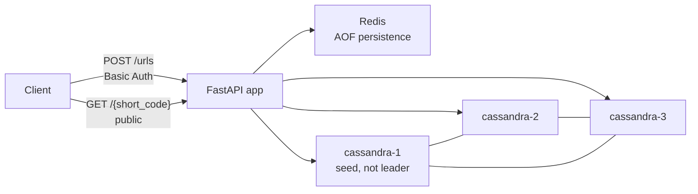
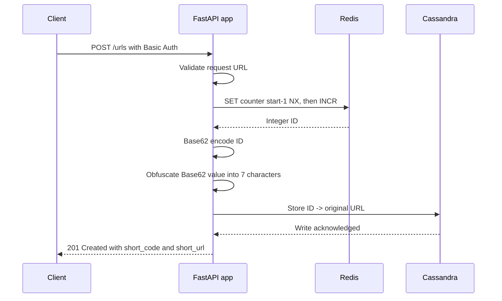
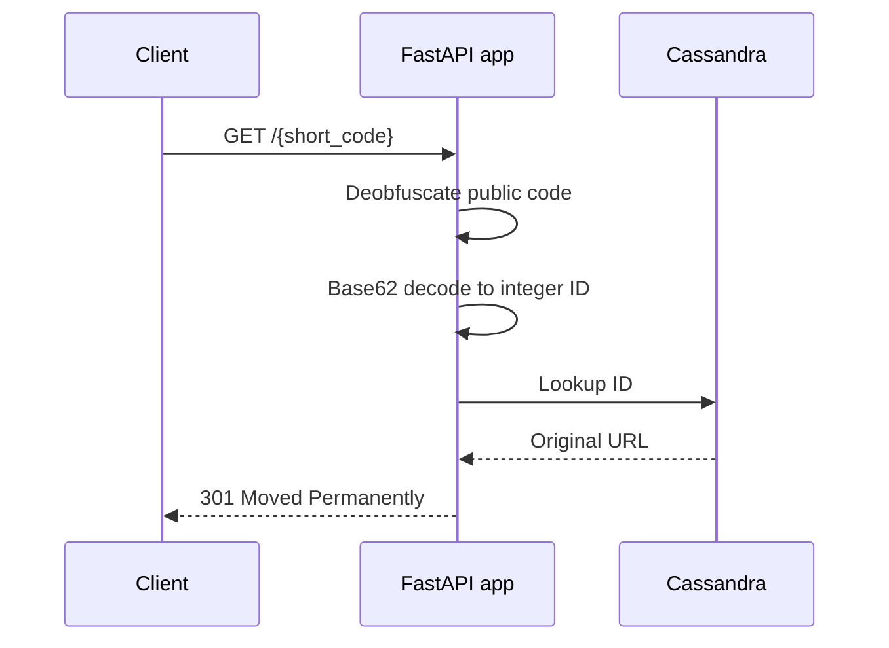

# Architecture

## Purpose

`url-shortener` is a backend/system-design portfolio project. It implements a small but complete URL shortener with authenticated URL creation, public URL resolution, Redis-backed ID generation, Cassandra persistence, Base62 encoding, and reversible public-code obfuscation.

The project avoids extra architectural layers so the runtime behavior can be explained directly in a technical interview.

## Runtime Components



Implemented components:

- FastAPI application served by Uvicorn.
- Route/controller/service organization.
- Route-level Basic Authentication for `POST /urls`.
- Public `GET /{short_code}` route with no authentication dependency.
- Redis client reused through the FastAPI lifespan.
- Cassandra cluster/session reused through the FastAPI lifespan.
- Redis ID generator using `SET ... NX` for non-destructive initialization and `INCR` for atomic IDs.
- Cassandra URL store using the `urls_by_id` table.
- Docker Compose environment with one Redis node and three Cassandra nodes.
- Idempotent Cassandra bootstrap for role, keyspace, and URL table creation.

## POST Flow



`POST /urls` requires `BASIC_AUTH_USERNAME` and `BASIC_AUTH_PASSWORD`. Authentication uses FastAPI `HTTPBasic` and constant-time comparison through `secrets.compare_digest`.

The response body is:

```json
{
  "short_code": "<7-character-code>",
  "short_url": "<SHORT_URL_BASE>/<7-character-code>"
}
```

Each valid POST creates a new ID. The implementation does not deduplicate URLs and does not set expiration or TTL.

## GET Flow



`GET /{short_code}` is intentionally public. It must work without a username, password, or `Authorization` header. Successful responses use `301 Moved Permanently` with the original URL in the `Location` header.

A `301` communicates that the redirect is permanent and may be cached aggressively by browsers and other clients. Because of that, changing the destination of an existing short code is not a reliably supported behavior.

Malformed or unknown short codes return `404 Not Found`. Cassandra lookup failures return `503 Service Unavailable`.

## Redis ID Generation

Redis owns atomic integer ID generation.

The first generated ID is intended to be:

```text
62^4 = 14,776,336
```

The Redis counter is initialized to:

```text
14,776,335
```

The first `INCR` then returns `14,776,336`, which encodes to `10000` with the configured Base62 alphabet.

Initialization uses `SET counter start-1 NX`, so an existing persisted counter is not overwritten. The generator initializes once per application instance and then uses Redis `INCR` for each new URL ID.

Redis AOF is enabled with `appendfsync everysec`. AOF is a durability mechanism, not a high-availability mechanism. It does not provide failover. If Redis loses acknowledged counter state while Cassandra keeps rows written with higher IDs, ID reuse can become a correctness concern.

## Base62 and Obfuscation

Base62 uses this alphabet:

```text
0123456789ABCDEFGHIJKLMNOPQRSTUVWXYZabcdefghijklmnopqrstuvwxyz
```

The key property is:

```text
decode_base62(encode_base62(value)) == value
```

Before a code is exposed publicly, the Base62 value is transformed by reversible obfuscation into exactly seven Base62 characters. The reverse operation restores the original Base62 value:

```text
deobfuscate_base62(obfuscate_base62(value)) == value
```

The obfuscation key comes from `OBFUSCATING_KEY`. It must not be committed or documented with a real value. This layer hides sequential IDs from public URLs, but it is obfuscation rather than strong encryption.

The public code space is:

```text
62^7 = 3,521,614,606,208
```

## Cassandra Persistence

Cassandra stores the lookup model required by the application:

```text
integer ID -> original URL
```

The table is:

```sql
CREATE TABLE IF NOT EXISTS urls_by_id (
    id bigint PRIMARY KEY,
    original_url text
);
```

The application resolves public codes by reversing the obfuscation, decoding Base62 to the integer ID, and querying Cassandra by primary key.

The local cluster has three peer-to-peer nodes:

- `cassandra-1`
- `cassandra-2`
- `cassandra-3`

`cassandra-1` is the seed node for discovery. It is not a leader, primary, master, source of truth, or permanent coordinator. Any appropriate Cassandra node may coordinate a request.

The configured keyspace uses `NetworkTopologyStrategy` with replication factor 3 in `datacenter1`. With three local nodes and RF=3, each row is replicated to the three nodes in that datacenter.

## Connection Lifecycle

The FastAPI lifespan creates reusable infrastructure clients on startup:

- one Redis client;
- one Redis ID generator;
- one Cassandra cluster/session pair;
- one Cassandra URL store.

The lifespan closes Redis and Cassandra resources during application shutdown. The application does not create a new Redis connection or Cassandra session for every request.

Docker Compose uses health checks and service dependencies for readiness. Startup is not based on arbitrary long sleeps.

## Failure Handling

Expected failure categories are handled explicitly:

- invalid POST input: FastAPI/Pydantic validation error;
- missing or invalid POST credentials: `401 Unauthorized` with `WWW-Authenticate: Basic`;
- unknown or malformed short code: `404 Not Found`;
- Redis ID generation failure: `503 Service Unavailable`;
- Cassandra persistence or lookup failure: `503 Service Unavailable`;
- missing required shortener configuration: `500 Internal Server Error`.

Client-facing errors do not expose credentials, internal hostnames, topology details, stack traces, or secret configuration values.

## Testing Strategy

The default test suite uses fakes for Redis and Cassandra behavior so unit and API tests are deterministic and fast. It covers:

- HTTP authentication and public redirect behavior;
- URL creation and resolution pipeline;
- Redis counter initialization and increment behavior;
- Cassandra store behavior;
- Base62 encoding/decoding;
- reversible obfuscation.

Live Redis/Cassandra behavior is validated through Docker Compose configuration and manual or integration-style checks, not by every default unit test.
