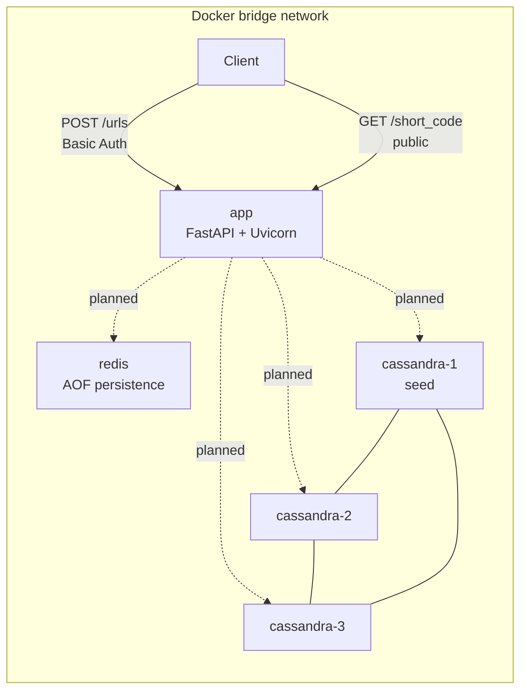
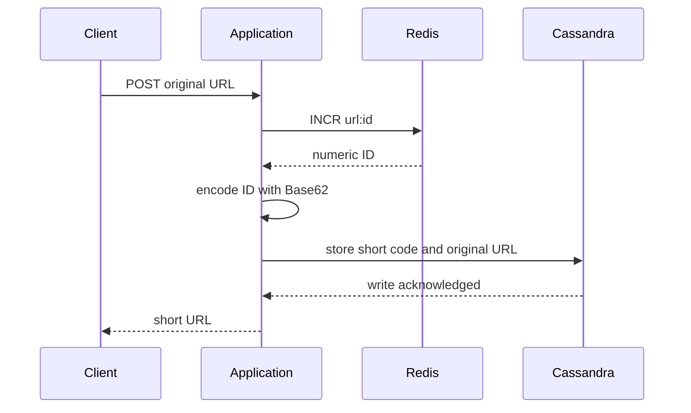
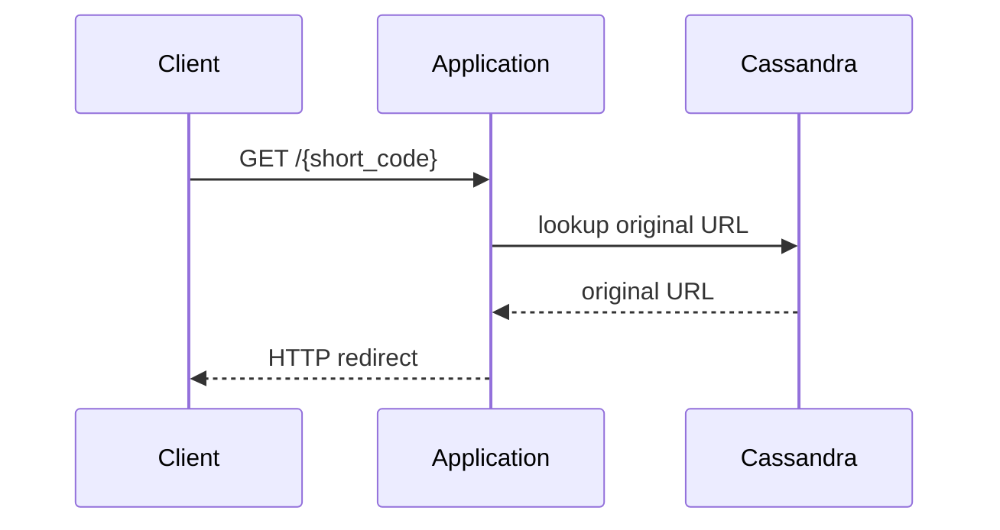
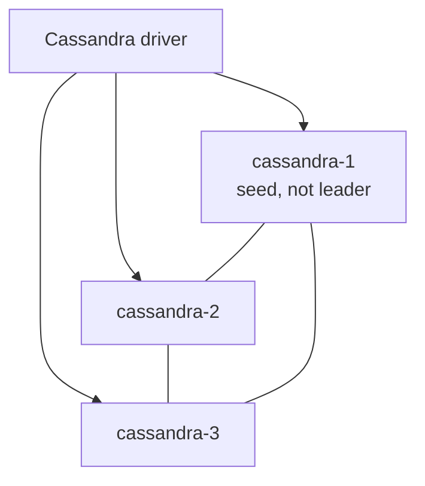

# Architecture

## Purpose

`url-shortener` is a learning-focused backend project for designing and implementing a URL shortening service. The goal is to keep each milestone technically sound, easy to explain in interviews, and free from unnecessary abstractions.

This milestone establishes local infrastructure and a minimal FastAPI HTTP skeleton. It does not implement real URL creation, redirects, Base62, Redis ID initialization, Cassandra schema, repositories, or business rules.

## Current Architecture

The current system is a Docker Compose environment with one FastAPI application container, one Redis node, and a three-node Cassandra cluster.



Implemented components:

- `app`: Python 3.14 container with `uv`, intended as the main development environment.
- FastAPI application skeleton served by Uvicorn.
- `POST /urls` route skeleton protected by HTTP Basic Authentication.
- `GET /{short_code}` public route skeleton.
- Automatic OpenAPI documentation generated by FastAPI.
- `redis`: Redis 7 with append-only file persistence.
- `cassandra-1`, `cassandra-2`, `cassandra-3`: Cassandra 5.0 nodes in a single local cluster.
- Docker volumes for Redis and each Cassandra node.
- Docker health checks for runtime readiness signals.
- Docker network-based service discovery using Compose service names.

The implemented HTTP routes return explicit `501 Not Implemented` placeholders. Redis and Cassandra are available but are not called by the routes yet.

## Current HTTP Skeleton

```mermaid
flowchart LR
    client[Client]
    post[POST /urls]
    auth[Basic Auth]
    post_placeholder[501 placeholder]
    get[GET /{short_code}]
    get_placeholder[501 placeholder]

    client --> post --> auth --> post_placeholder
    client --> get --> get_placeholder
```

`POST /urls` requires Basic Auth because URL creation is treated as an administrative operation at this stage. `GET /{short_code}` is intentionally public because future short URL resolution must not require credentials.

## Planned Application Flow

Future write flow:



Future read flow:



## Redis

Redis is planned to generate numeric IDs atomically with `INCR`, conceptually using a key such as `url:id`. This avoids manual locking for concurrent requests because Redis executes the increment atomically. The current FastAPI routes do not use Redis yet.

The planned first generated ID is:

```text
62^4 = 14,776,336
```

If the first `INCR` must return `14,776,336`, the previous stored counter value must be `14,776,335`.

This milestone does not initialize that key. Initialization must be implemented later without destructively resetting a persisted counter on every Redis startup.

Redis persistence:

- AOF is enabled with `appendfsync everysec`.
- Data is stored in the `redis_data` Docker volume.
- Restarts should preserve the local counter state as long as the volume is kept.
- This local setup does not claim zero data loss; with `appendfsync everysec`, the most recent writes can still be at risk during a crash.

## Base62

Base62 encoding is planned as the transformation from numeric ID to short code. This milestone does not choose hashing, encryption, random IDs, UUIDs, Snowflake IDs, reversible permutations, or obfuscation strategies.

## Cassandra

Cassandra is included to study distributed storage concepts such as distribution, replication, consistency levels, availability, and horizontal scaling. The current FastAPI routes do not read from or write to Cassandra yet.

The local cluster has three peer-to-peer nodes:

- `cassandra-1`
- `cassandra-2`
- `cassandra-3`

`cassandra-1` is configured as the seed node. A seed node helps other nodes discover the cluster topology. It is not a leader, master, primary node, source of truth, or permanent coordinator. Cassandra coordinators are selected per request by the driver and cluster routing behavior.



Each Cassandra node has independent persistence:

- `cassandra-1` -> `cassandra_data_1`
- `cassandra-2` -> `cassandra_data_2`
- `cassandra-3` -> `cassandra_data_3`

No Cassandra data directory is shared between nodes.

## Replication

The intended study setup is a keyspace with replication factor 3 in one local datacenter. A future keyspace should use a strategy appropriate to the configured datacenter, such as `NetworkTopologyStrategy` with the local datacenter name.

With three Cassandra nodes and RF=3, each row should be replicated to all three nodes in that datacenter. This is useful for learning availability and consistency tradeoffs, but it does not prove production scalability or throughput by itself.

No keyspace or table is created in this milestone because the access patterns and data model have not been decided yet.

## Docker Networking

Services communicate through the Compose bridge network by DNS name:

- `app` -> `redis`
- `app` -> `cassandra-1`
- `app` -> `cassandra-2`
- `app` -> `cassandra-3`

The Compose file publishes the application port for local HTTP development. Redis and Cassandra ports are not published to the host by default; development checks for those services are executed through containers.

## Deferred Decisions

- Real URL creation behavior.
- URL resolution lookup and redirect.
- Redis counter initialization process.
- Base62 implementation details.
- Cassandra keyspace and table model.
- Cassandra consistency levels.
- Cassandra client and repository boundaries.
- Definitive URL validation and API contracts.
- Lint and formatter configuration.
