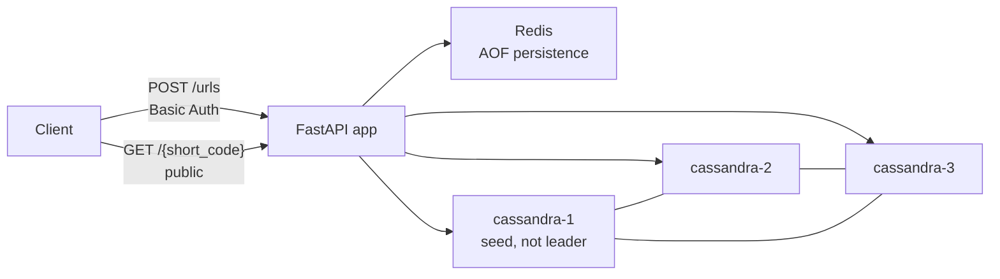
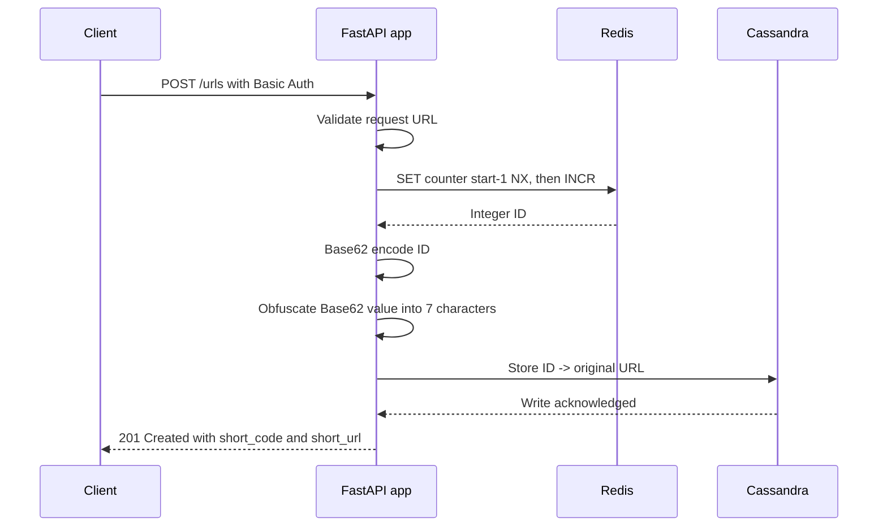
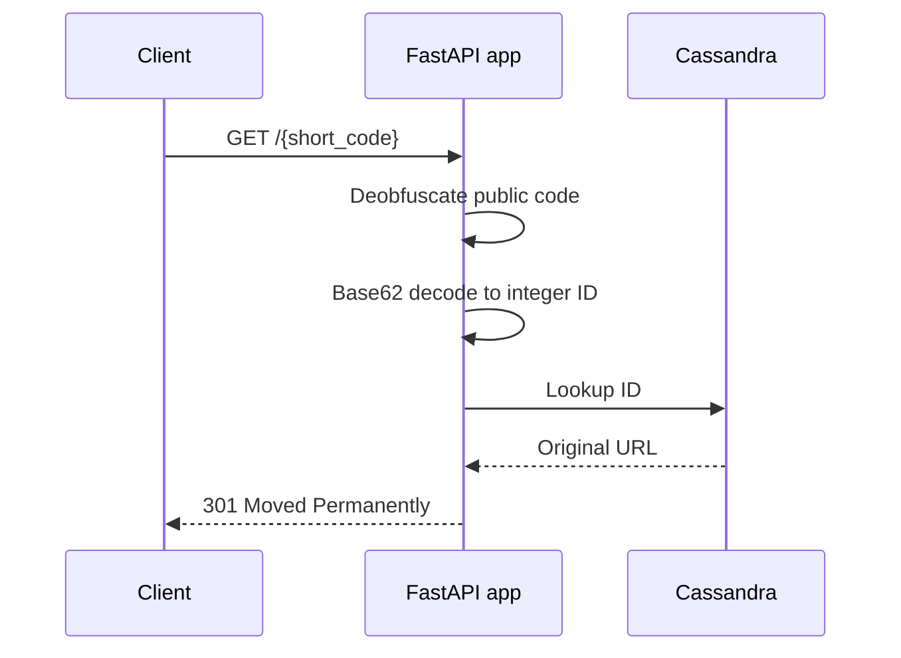

# Architecture

[English](architecture.md) | [Português](../pt-BR/architecture.md)

## Purpose

`url-shortener` is a backend/system-design portfolio project. It implements a small but complete URL shortener with authenticated URL creation, public URL resolution, Redis-backed ID generation, Cassandra persistence, Base62 encoding, and reversible public-code obfuscation.

The project avoids extra architectural layers so the runtime behavior can be explained directly in a technical interview.

## Runtime Components


```mermaid
flowchart LR
    client["Client"]
    app["FastAPI app"]
    redis["Redis<br/>AOF persistence"]
    c1["cassandra-1<br/>seed, not leader"]
    c2["cassandra-2"]
    c3["cassandra-3"]

    client -->|"POST /urls<br/>Basic Auth"| app
    client -->|"GET /{short_code}<br/>public"| app

    app --> redis
    app --> c1
    app --> c2
    app --> c3

    c1 --- c2
    c2 --- c3
    c1 --- c3
```

Implemented components:

- FastAPI application served by Uvicorn.
- Route/controller/service organization.
- Route-level Basic Authentication for `POST /urls`.
- Public `GET /{short_code}` route with no authentication dependency.
- Redis client reused through the FastAPI lifespan.
- Cassandra cluster/session reused through the FastAPI lifespan.
- Redis ID generator using `SET ... NX` for non-destructive initialization and `INCR` for atomic IDs.
- Cassandra URL store using the `urls_by_id` table.
- Docker Compose environment with one Redis node and three Cassandra nodes.
- Idempotent Cassandra bootstrap for role, keyspace, and URL table creation.

## POST Flow


```mermaid
sequenceDiagram
    participant Client
    participant App as FastAPI app
    participant Redis
    participant Cassandra

    Client->>App: POST /urls with Basic Auth
    App->>App: Validate request URL
    App->>Redis: SET counter start-1 NX, then INCR
    Redis-->>App: Integer ID
    App->>App: Base62 encode ID
    App->>App: Obfuscate Base62 value into 7 characters
    App->>Cassandra: Store ID -> original URL
    Cassandra-->>App: Write acknowledged
    App-->>Client: 201 Created with short_code and short_url
```

`POST /urls` requires `BASIC_AUTH_USERNAME` and `BASIC_AUTH_PASSWORD`. Authentication uses FastAPI `HTTPBasic` and constant-time comparison through `secrets.compare_digest`.

The response body is:

```json
{
  "short_code": "<7-character-code>",
  "short_url": "<SHORT_URL_BASE>/<7-character-code>"
}
```

Each valid POST creates a new ID. The implementation does not deduplicate URLs and does not set expiration or TTL.

## GET Flow


```mermaid
sequenceDiagram
    participant Client
    participant App as FastAPI app
    participant Cassandra

    Client->>App: GET /{short_code}
    App->>App: Deobfuscate public code
    App->>App: Base62 decode to integer ID
    App->>Cassandra: Lookup ID
    Cassandra-->>App: Original URL
    App-->>Client: 301 Moved Permanently
```

`GET /{short_code}` is intentionally public. It must work without a username, password, or `Authorization` header. Successful responses use `301 Moved Permanently` with the original URL in the `Location` header.

A `301` communicates that the redirect is permanent and may be cached aggressively by browsers and other clients. Because of that, changing the destination of an existing short code is not a reliably supported behavior.

Malformed or unknown short codes return `404 Not Found`. Cassandra lookup failures return `503 Service Unavailable`.

## Redis ID Generation

Redis owns atomic integer ID generation.

The first generated ID is intended to be:

```text
62^4 = 14,776,336
```

The Redis counter is initialized to:

```text
14,776,335
```

The first `INCR` then returns `14,776,336`, which encodes to `10000` with the configured Base62 alphabet.

Initialization uses `SET counter start-1 NX`, so an existing persisted counter is not overwritten. The generator initializes once per application instance and then uses Redis `INCR` for each new URL ID.

Redis AOF is enabled with `appendfsync everysec`. AOF is a durability mechanism, not a high-availability mechanism. It does not provide failover. If Redis loses acknowledged counter state while Cassandra keeps rows written with higher IDs, ID reuse can become a correctness concern.

## Base62 and Obfuscation

Base62 uses this alphabet:

```text
0123456789ABCDEFGHIJKLMNOPQRSTUVWXYZabcdefghijklmnopqrstuvwxyz
```

The key property is:

```text
decode_base62(encode_base62(value)) == value
```

Before a code is exposed publicly, the Base62 value is transformed by reversible obfuscation into exactly seven Base62 characters. The reverse operation restores the original Base62 value:

```text
deobfuscate_base62(obfuscate_base62(value)) == value
```

The obfuscation key comes from `OBFUSCATING_KEY`. It must not be committed or documented with a real value. This layer hides sequential IDs from public URLs, but it is obfuscation rather than strong encryption.

The public code space is:

```text
62^7 = 3,521,614,606,208
```

## Cassandra Persistence

Cassandra stores the lookup model required by the application:

```text
integer ID -> original URL
```

The table is:

```sql
CREATE TABLE IF NOT EXISTS urls_by_id (
    id bigint PRIMARY KEY,
    original_url text
);
```

The application resolves public codes by reversing the obfuscation, decoding Base62 to the integer ID, and querying Cassandra by primary key.

The local cluster has three peer-to-peer nodes:

- `cassandra-1`
- `cassandra-2`
- `cassandra-3`

`cassandra-1` is the seed node for discovery. It is not a leader, primary, master, source of truth, or permanent coordinator. Any appropriate Cassandra node may coordinate a request.

The configured keyspace uses `NetworkTopologyStrategy` with replication factor 3 in `datacenter1`. With three local nodes and RF=3, each row is replicated to the three nodes in that datacenter.

## Connection Lifecycle

The FastAPI lifespan creates reusable infrastructure clients on startup:

- one Redis client;
- one Redis ID generator;
- one Cassandra cluster/session pair;
- one Cassandra URL store.

The lifespan closes Redis and Cassandra resources during application shutdown. The application does not create a new Redis connection or Cassandra session for every request.

Docker Compose uses health checks and service dependencies for readiness. Startup is not based on arbitrary long sleeps.

## Failure Handling

Expected failure categories are handled explicitly:

- invalid POST input: FastAPI/Pydantic validation error;
- missing or invalid POST credentials: `401 Unauthorized` with `WWW-Authenticate: Basic`;
- unknown or malformed short code: `404 Not Found`;
- Redis ID generation failure: `503 Service Unavailable`;
- Cassandra persistence or lookup failure: `503 Service Unavailable`;
- missing required shortener configuration: `500 Internal Server Error`.

Client-facing errors do not expose credentials, internal hostnames, topology details, stack traces, or secret configuration values.

## Testing Strategy

The default test suite uses fakes for Redis and Cassandra behavior so unit and API tests are deterministic and fast. It covers:

- HTTP authentication and public redirect behavior;
- URL creation and resolution pipeline;
- Redis counter initialization and increment behavior;
- Cassandra store behavior;
- Base62 encoding/decoding;
- reversible obfuscation.

Live Redis/Cassandra behavior is validated through Docker Compose configuration and manual or integration-style checks, not by every default unit test.

## Architecture Decisions & Trade-offs

### Scope and evidence

**Implemented:** synchronous URL creation/resolution, reusable clients, Redis counter, Cassandra primary-key mappings, deterministic obfuscation, Basic Auth and fake-based tests. **Designed / architecturally prepared:** application instances can share backing stores, but no multi-instance deployment or failover is implemented. **Planned / future work:** live dependency/failure tests, measured capacity, recovery/HA, abuse controls and production operations. These are review candidates, not delivered features.

The Technical Interview URL Shortener guide supports the learning intent (Python and distributed persistence). Source remains authoritative. Alternatives below are engineering comparisons, not a claim that each was historically prototyped.

### Decision: Python/FastAPI with synchronous dependency calls

**Context and decision.** The workload coordinates URL validation and two stores rather than heavy computation. Python supports the stated learning objective; FastAPI provides Pydantic `HttpUrl`, OpenAPI and authentication dependencies. Routes are ordinary `def` functions, so synchronous Redis/Cassandra calls run through the framework's worker-thread handling; `async` lifespan does not make database operations asynchronous.

**Why and alternatives.** Route → controller → service → infrastructure makes HTTP error mapping distinct from orchestration and store access. A smaller combined route/service would reduce files; an async driver design could avoid occupying threads during I/O but needs compatible clients and measured justification. Go or Java could implement the same contracts with different tooling.

**Trade-offs and consequences.** The service imports concrete infrastructure and Pydantic schemas; helpers read globally cached settings rather than the injected service settings. These are practical seams for fakes, not strict Clean Architecture. Slow stores occupy request workers. Clients are reused and closed by lifespan, but startup must connect Cassandra and create the table before serving requests.

**Revisit when.** Load tests reveal worker saturation, multiple adapters are needed, or globally configured helpers make isolation difficult.

**Evidence:** [routes](../../app/api/routes.py), [controller](../../app/controllers/url_controller.py), [service](../../app/services/url_service.py), [lifespan](../../app/main.py), [schemas](../../app/schemas.py).

### Decision: Redis atomic IDs separated from durable mappings

**Context and decision.** Concurrent writers need distinct integers before creating public codes. `SET ... NX` initializes to `start - 1` without resetting an existing counter; `INCR` allocates IDs atomically across application instances sharing the same Redis key. The process lock protects local initialization, not distributed allocation. Starting at `62^4` produces `10000` under the default alphabet, rather than enforcing a fundamental shortener requirement.

**Why and alternatives.** An atomic primitive avoids application-level read/modify/write races. A relational sequence plus mapping in one database would remove the two-store coordination problem. Random codes need collision detection/retries; distributed numeric IDs or allocated ID blocks need a different recovery/coordination model. Cassandra `MAX(id)+1` is not a safe concurrent allocator.

**Trade-offs and consequences.** Redis is neither a queue nor a redirect cache. One Redis centralizes all creates and has no failover. AOF `everysec` improves persistence but does not guarantee retention of every acknowledged increment. If Cassandra writing fails after allocation, a gap is acceptable. A timeout may leave the caller unsure whether the mapping persisted; retry is not idempotent and creates another ID. Counter rollback/reinitialization can reuse an existing Cassandra key, and the ordinary `INSERT` is an upsert: it has no conditional collision guard. Recovery is therefore a correctness issue, not only an availability issue. Existing redirects do not call Redis, although a cold application still needs its configured startup dependencies.

**Revisit when.** Durable uniqueness after recovery, write availability or sustained allocation load becomes a production requirement. Coordinate restores of both stores before allowing writes.

**Evidence:** [generator](../../app/infrastructure/redis_id_generator.py), [store](../../app/infrastructure/cassandra_url_store.py), [Compose AOF](../../compose.yaml), [generator tests](../../tests/test_redis_id_generator.py).

### Decision: Primary-key Cassandra persistence for a distributed-storage exercise

**Context and decision.** Resolution has one known integer ID and needs one original URL. `id bigint PRIMARY KEY` makes each ID the partition key with no clustering columns; the table is query-oriented and has no joins, original-URL index, TTL or deduplication. Partition placement uses Cassandra's partitioner; sequential integers do not create a single shared counter partition in this table.

**Why and alternatives.** The interview guide explicitly frames Cassandra as a distributed-system learning choice. PostgreSQL or even a single durable key/value store would be operationally simpler for a small deployed shortener. Cassandra is not required by measured traffic.

**Trade-offs and consequences.** Bootstrap configures NetworkTopologyStrategy with RF=3 in the chosen datacenter. With three local nodes, this demonstrates replication, not three independent physical failure domains. The seed supports discovery and is not a leader. `DCAwareRoundRobinPolicy` prefers the configured datacenter. The execution profile does **not** explicitly set read/write consistency; behavior depends on the locked driver defaults. RF=3 alone does not establish a project-owned read-after-write guarantee. An explicit quorum policy would trade additional replica acknowledgements for latency/availability under failures; it is not configured here. No benchmark or production capacity is claimed.

**Revisit when.** Read-after-create guarantees, topology, operational cost or access patterns change. Set and test consistency explicitly, including partitions and node loss, before claiming availability guarantees.

**Evidence:** [store and execution profile](../../app/infrastructure/cassandra_url_store.py), [bootstrap](../../docker/cassandra/bootstrap.sh), [lockfile](../../uv.lock), [Compose topology](../../compose.yaml).

### Decision: Reversible seven-character codes instead of storing a separate public key

**Context and decision.** An integer ID is Base62 encoded, then permuted using `(a * id + b) mod 62^7`; key-derived `a` is coprime to the modulus, permitting a modular inverse. Resolution reverses the transformation and looks up the integer without a second index.

**Why and alternatives.** For unique IDs within the supported domain, fixed key and default alphabet, the permutation avoids random-code collisions and conceals the obvious sequence. Direct Base62 is simpler but sequential; random stored public keys decouple links from a reversible configuration but require uniqueness enforcement. Reviewed cryptographic constructions would be appropriate if unpredictability were a security requirement.

**Trade-offs and consequences.** This is obfuscation, not encryption or access control. `62^7` is a mathematical domain, not measured storage capacity; allocation starts above zero and encoding rejects IDs beyond that domain. Key/alphabet changes alter resolution of already issued links because no version is stored. Alphabet validation checks only length/uniqueness, while padding hardcodes `0`; arbitrary custom alphabets need careful compatibility validation. All instances must share stable codec settings.

**Revisit when.** Key rotation, larger code space, cryptographic unpredictability or arbitrary alphabet support is required. Preserve old decoding versions or migrate to persisted public identifiers.

**Evidence:** [Base62](../../app/helpers/base62.py), [obfuscation](../../app/helpers/obfuscation.py), [round-trip tests](../../tests/test_obfuscation.py).

### Decision: Authenticated creation, public permanent redirects

**Context and decision.** Creating mappings changes state; sharing a short link should not require a recipient account. POST uses one configured Basic Auth credential pair with constant-time comparisons. GET returns `301`; malformed and unknown codes share a 404 response, while expected dependency failures produce generic 503 responses.

**Why and alternatives.** This is a small API contract without account persistence. Per-user tokens would enable ownership/quotas at greater identity complexity. Temporary redirects would better support editable destinations.

**Trade-offs and consequences.** Basic Auth needs TLS outside loopback and offers no users, roles, revocation per user or rate limits. `HttpUrl` validates HTTP(S) syntax, not destination safety or anti-phishing policy; the backend does not fetch the destination. Public codes are not private links. A 301 may be cached, making future edits/deletion enforcement and complete click analytics unreliable. Missing auth/codec configuration yields 500 rather than a functioning service. A client timeout/retry has no idempotency contract.

**Revisit when.** Links become editable, ownership or analytics is introduced, or public exposure requires abuse handling. Define redirect caching and authentication requirements first.

**Evidence:** [security](../../app/core/security.py), [controller](../../app/controllers/url_controller.py), [HTTP tests](../../tests/test_http.py).

### Decision: Local Docker cluster and fast tests, with explicit operational limits

**Context and decision.** Compose runs the app, one Redis, three Cassandra nodes and a bootstrap job. Reload/source mounts support development; loopback listeners restrict host exposure; the app runs non-root. The frozen uv lock supplies reproducible Python dependencies. Fakes test HTTP, helpers, counter commands and storage calls without running the cluster.

**Why and alternatives.** Three local nodes make replication inspectable at higher resource cost than one node. Fakes isolate contracts cheaply; ephemeral real-dependency tests would test actual consistency, persistence and failure behavior at greater startup cost. Production multi-host deployment is a different requirement from local Compose.

**Trade-offs and consequences.** Bootstrap is repeatable but not read-only: it can alter role passwords/privileges and keyspace replication, including `system_auth`. The application role is SUPERUSER, and health checks can fall back to default Cassandra credentials. Startup also issues `CREATE TABLE IF NOT EXISTS`. Do not interpret this as least-privilege production provisioning. The app health check fetches OpenAPI, not a live data-path probe. Existing fake tests do not verify real counter concurrency, Cassandra repair, failover or data recovery. There is no tracked project CI deployment pipeline.

**Revisit when.** Production deployment or dependable recovery is required: separate privileged provisioning from runtime credentials, define health/readiness and add real dependency/failure tests. No cache/broker should be added without a workload or delivery requirement.

**Evidence:** [Compose](../../compose.yaml), [Dockerfile](../../docker/Dockerfile), [bootstrap](../../docker/cassandra/bootstrap.sh), [healthcheck](../../docker/cassandra/healthcheck.sh), [test guide](testing.md).

### Documentation review verification — 2026-10-05

All 82 existing tests passed in a disposable `url-shortener-app:local` container using read-only current app/test mounts and `uv run --frozen pytest -p no:cacheprovider`. An offline attempt lacked a locked test dependency; enabling dependency downloads allowed the suite to run. Tests used fakes and isolated settings, not live Redis/Cassandra. The application lifespan/full Compose stack was not started, because bootstrap writes role/schema configuration. No database directories or local `.env` were mounted. Containers were removed; this is no claim of real cluster/failover verification.

## Source-review limitations — 2026-10-09

The helpers read global cached settings even when a service receives injected Settings. `obfuscate_base62` pads with literal `0`, while alphabet validation only checks 62 unique characters. The default alphabet starts with 0; a custom alphabet with another zero digit can produce incorrectly decoded padded codes (or invalid characters if it omits 0). Keep existing key/alphabet stable; arbitrary alphabet support is not a verified guarantee. This issue is documented, not fixed.

`RedisIdGenerator` remembers initialization in process memory and does not recheck the counter on later calls. Loss/deletion of the key while the process remains initialized bypasses the start-1 setup; subsequent INCR can restart below the configured range. This is another ID-reuse/recovery risk, distinct from harmless allocation gaps after Cassandra failure. Existing fake tests cover initialization and failures, not that recovery scenario or live concurrency. No tests or dependency services were run in this audit.
