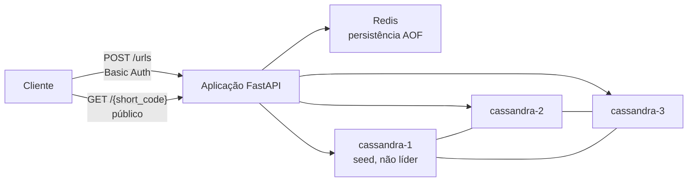
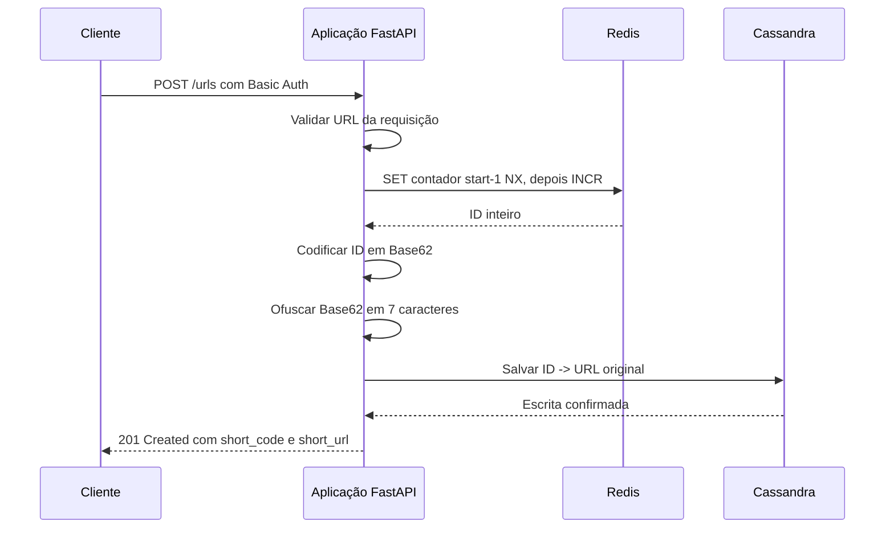
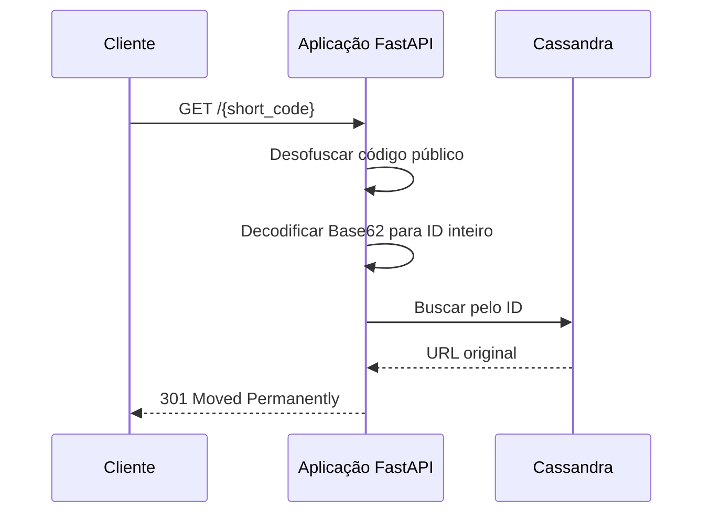

# Arquitetura

## Propósito

`url-shortener` é um projeto backend de portfólio com foco em desenho de sistemas. Ele implementa um encurtador de URLs com criação autenticada, resolução pública, geração de IDs no Redis, persistência no Cassandra, codificação Base62 e ofuscação reversível do código público.

A arquitetura evita camadas desnecessárias para que o comportamento do sistema seja direto de explicar em uma entrevista técnica.

## Componentes em Execução



Componentes implementados:

- Aplicação FastAPI servida por Uvicorn.
- Organização em rota, controller e serviço.
- Basic Authentication em nível de rota para `POST /urls`.
- Rota pública `GET /{short_code}`, sem dependência de autenticação.
- Cliente Redis reaproveitado pelo lifespan do FastAPI.
- Cluster/session Cassandra reaproveitados pelo lifespan do FastAPI.
- Gerador de IDs Redis usando `SET ... NX` para inicialização não destrutiva e `INCR` para IDs atômicos.
- Store Cassandra usando a tabela `urls_by_id`.
- Ambiente Docker Compose com um Redis e três nós Cassandra.
- Bootstrap Cassandra idempotente para role, keyspace e tabela de URLs.

## Fluxo do POST



`POST /urls` exige `BASIC_AUTH_USERNAME` e `BASIC_AUTH_PASSWORD`. A autenticação usa `HTTPBasic` do FastAPI e comparação em tempo constante com `secrets.compare_digest`.

O corpo da resposta é:

```json
{
  "short_code": "<código-de-7-caracteres>",
  "short_url": "<SHORT_URL_BASE>/<código-de-7-caracteres>"
}
```

Cada POST válido cria um novo ID. A implementação não faz deduplicação de URLs e não define expiração ou TTL.

## Fluxo do GET



`GET /{short_code}` é público de propósito. Ele deve funcionar sem usuário, senha ou header `Authorization`. Em caso de sucesso, a resposta usa `301 Moved Permanently` com a URL original no header `Location`.

Um `301` comunica redirecionamento permanente e pode ser cacheado de forma agressiva por navegadores e outros clientes. Por isso, trocar o destino de um código já emitido não é um comportamento suportado de forma confiável.

Códigos malformados ou desconhecidos retornam `404 Not Found`. Falhas de consulta no Cassandra retornam `503 Service Unavailable`.

## Geração de IDs no Redis

O Redis é responsável por gerar IDs inteiros de forma atômica.

O primeiro ID gerado deve ser:

```text
62^4 = 14.776.336
```

O contador Redis é inicializado com:

```text
14.776.335
```

Assim, o primeiro `INCR` retorna `14.776.336`, que codifica para `10000` com o alfabeto Base62 configurado.

A inicialização usa `SET contador start-1 NX`, então um contador já persistido não é sobrescrito. O gerador inicializa uma vez por instância da aplicação e depois usa `INCR` a cada nova URL.

O Redis está com AOF habilitado e `appendfsync everysec`. AOF é um mecanismo de durabilidade, não de alta disponibilidade. Ele não fornece failover. Se o Redis perder estado já confirmado do contador enquanto o Cassandra mantiver linhas gravadas com IDs maiores, reutilização de ID pode se tornar um problema de corretude.

## Base62 e Ofuscação

Base62 usa o alfabeto:

```text
0123456789ABCDEFGHIJKLMNOPQRSTUVWXYZabcdefghijklmnopqrstuvwxyz
```

A propriedade essencial é:

```text
decode_base62(encode_base62(value)) == value
```

Antes de expor o código publicamente, o valor Base62 passa por uma ofuscação reversível e vira exatamente sete caracteres Base62. A operação inversa recupera o valor Base62 original:

```text
deobfuscate_base62(obfuscate_base62(value)) == value
```

A chave de ofuscação vem de `OBFUSCATING_KEY`. Ela não deve ser commitada nem documentada com valor real. Essa camada esconde IDs sequenciais nas URLs públicas, mas é ofuscação, não criptografia forte.

O espaço de códigos públicos é:

```text
62^7 = 3.521.614.606.208
```

## Persistência no Cassandra

O Cassandra armazena o modelo de consulta necessário para a aplicação:

```text
ID inteiro -> URL original
```

A tabela é:

```sql
CREATE TABLE IF NOT EXISTS urls_by_id (
    id bigint PRIMARY KEY,
    original_url text
);
```

Para resolver um código público, a aplicação desfaz a ofuscação, decodifica o Base62 para o ID inteiro e consulta o Cassandra pela chave primária.

O cluster local tem três nós peer-to-peer:

- `cassandra-1`
- `cassandra-2`
- `cassandra-3`

`cassandra-1` é o seed node para descoberta. Ele não é líder, primary, master, fonte única de verdade ou coordenador permanente. Qualquer nó Cassandra apropriado pode coordenar uma requisição.

O keyspace configurado usa `NetworkTopologyStrategy` com fator de replicação 3 em `datacenter1`. Com três nós locais e RF=3, cada linha é replicada para os três nós desse datacenter.

## Ciclo de Vida das Conexões

O lifespan do FastAPI cria recursos reutilizáveis no startup:

- um cliente Redis;
- um gerador de IDs Redis;
- um par cluster/session Cassandra;
- um store Cassandra de URLs.

No shutdown, o lifespan fecha os recursos Redis e Cassandra. A aplicação não cria uma conexão Redis ou uma session Cassandra nova a cada requisição.

O Docker Compose usa health checks e dependências entre serviços para prontidão. O startup não depende de sleeps arbitrários.

## Tratamento de Falhas

As falhas esperadas são tratadas explicitamente:

- entrada inválida no POST: erro de validação FastAPI/Pydantic;
- credenciais ausentes ou inválidas no POST: `401 Unauthorized` com `WWW-Authenticate: Basic`;
- código curto desconhecido ou malformado: `404 Not Found`;
- falha na geração de ID no Redis: `503 Service Unavailable`;
- falha de persistência ou consulta no Cassandra: `503 Service Unavailable`;
- configuração obrigatória ausente para encurtamento: `500 Internal Server Error`.

As respostas para clientes não expõem credenciais, hostnames internos, detalhes de topologia, stack traces ou valores secretos de configuração.

## Estratégia de Testes

A suíte padrão usa fakes para os comportamentos de Redis e Cassandra, mantendo os testes unitários e de API determinísticos e rápidos. Ela cobre:

- autenticação HTTP e comportamento do redirecionamento público;
- pipeline de criação e resolução de URLs;
- inicialização e incremento do contador Redis;
- comportamento do store Cassandra;
- codificação/decodificação Base62;
- ofuscação reversível.

O comportamento com Redis e Cassandra reais é validado por configuração Docker Compose e verificações manuais ou de integração, não por todos os testes unitários padrão.
