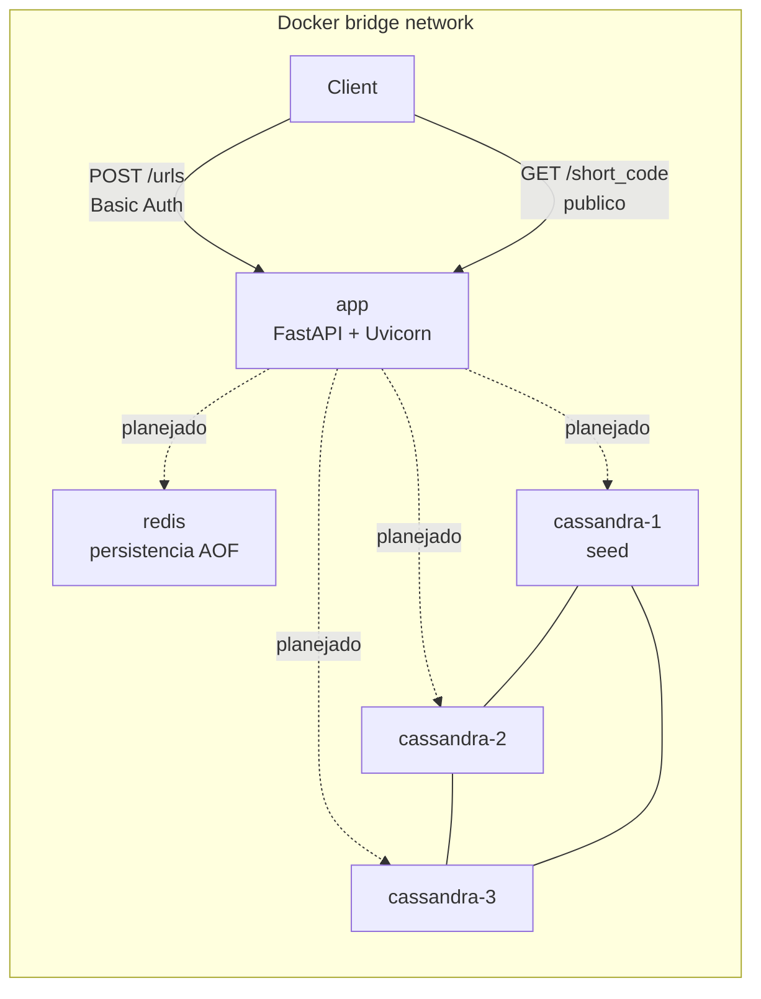
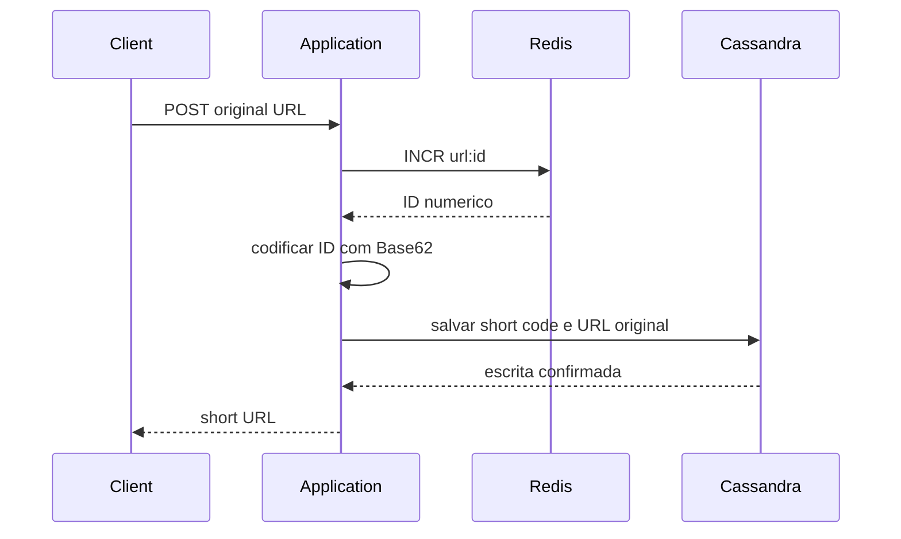
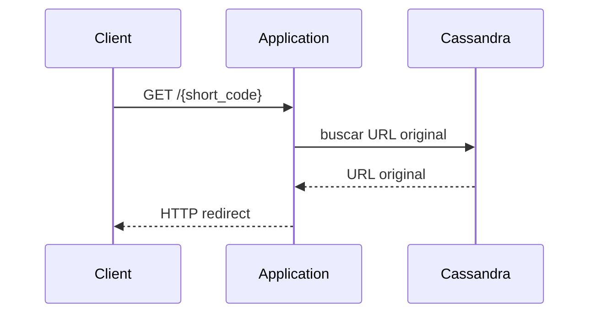
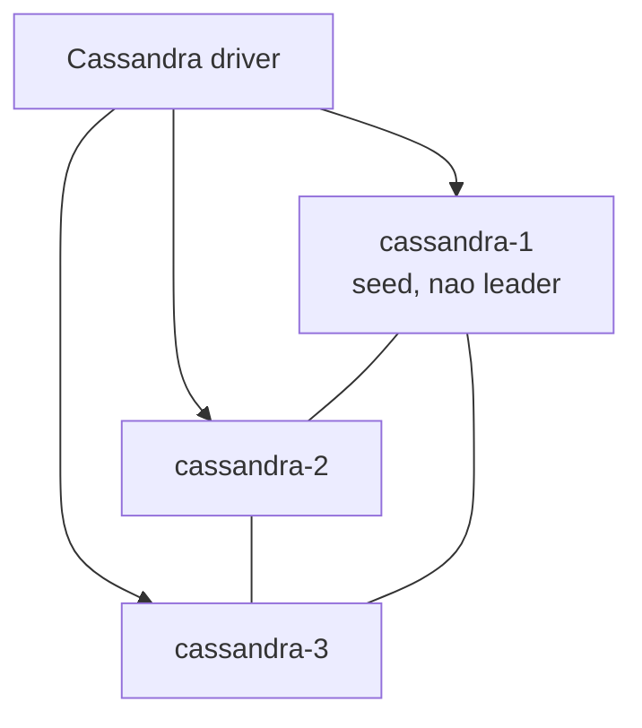

# Arquitetura

## Propósito

`url-shortener` é um projeto backend voltado a aprendizado e portfólio, com foco em encurtamento de URLs, decisões de arquitetura e fundamentos de sistemas distribuídos.

Esta etapa cria a infraestrutura local e um esqueleto HTTP mínimo com FastAPI. Ela não implementa criação real de URL curta, redirects, Base62, inicialização do contador Redis, schema Cassandra, repositories ou regras de negócio.

## Arquitetura Atual

O sistema atual é um ambiente Docker Compose com uma aplicação FastAPI, um Redis e um cluster Cassandra local com três nós.



Componentes implementados:

- `app`: container Python 3.14 com `uv`, usado como ambiente principal de desenvolvimento.
- Esqueleto FastAPI servido por Uvicorn.
- Rota `POST /urls` protegida por HTTP Basic Authentication.
- Rota pública `GET /{short_code}`.
- Documentação OpenAPI automática gerada pelo FastAPI.
- `redis`: Redis 7 com persistência append-only file.
- `cassandra-1`, `cassandra-2`, `cassandra-3`: nós Cassandra 5.0 no mesmo cluster local.
- Volumes Docker para Redis e para cada nó Cassandra.
- Health checks para sinais de prontidão dos serviços.
- Descoberta de serviços por DNS usando os nomes do Docker Compose.

As rotas HTTP implementadas retornam placeholders explícitos com `501 Not Implemented`. Redis e Cassandra estão disponíveis na infraestrutura, mas ainda não são usados pelas rotas.

## Esqueleto HTTP Atual

```mermaid
flowchart LR
    client[Client]
    post[POST /urls]
    auth[Basic Auth]
    post_placeholder[501 placeholder]
    get[GET /{short_code}]
    get_placeholder[501 placeholder]

    client --> post --> auth --> post_placeholder
    client --> get --> get_placeholder
```

`POST /urls` exige Basic Auth porque a criação de URL é tratada como operação administrativa nesta etapa. `GET /{short_code}` é público de propósito, já que a resolução futura de short URLs não deve exigir credenciais.

## Fluxo Planejado da Aplicação

Fluxo futuro de escrita:



Fluxo futuro de leitura:



## Redis

O Redis será usado futuramente para gerar IDs numéricos de forma atômica com `INCR`, conceitualmente em uma chave como `url:id`. Isso evita locks manuais em requisições concorrentes, porque o incremento é atômico dentro do Redis. As rotas FastAPI atuais ainda não usam Redis.

O primeiro ID planejado é:

```text
62^4 = 14.776.336
```

Se o primeiro `INCR` deve retornar `14.776.336`, o valor anterior armazenado no contador precisa ser `14.776.335`.

Esta etapa não inicializa essa chave. Essa inicialização deve ser implementada depois sem resetar de forma destrutiva um contador persistido a cada inicialização do Redis.

Persistência do Redis:

- AOF está habilitado com `appendfsync everysec`.
- Os dados ficam no volume Docker `redis_data`.
- Restarts preservam o estado local enquanto o volume for mantido.
- Essa configuração local não promete perda zero de dados; com `appendfsync everysec`, escritas muito recentes ainda podem estar em risco em uma falha brusca.

## Base62

Base62 está planejado como a transformação do ID numérico para o short code. Esta etapa não escolhe hash, criptografia, IDs aleatórios, UUIDs, Snowflake, permutação reversível ou estratégia de ofuscação.

## Cassandra

Cassandra foi incluído para estudar conceitos como distribuição, replicação, consistency levels, disponibilidade e escalabilidade horizontal. As rotas FastAPI atuais ainda não leem nem escrevem no Cassandra.

O cluster local possui três nós peer-to-peer:

- `cassandra-1`
- `cassandra-2`
- `cassandra-3`

`cassandra-1` é configurado como seed node. Um seed node ajuda outros nós a descobrirem a topologia do cluster. Ele não é leader, master, primary, fonte única de verdade ou coordenador permanente. Em Cassandra, o papel de coordenador depende da requisição e do roteamento feito pelo driver.



Cada nó Cassandra possui persistência independente:

- `cassandra-1` -> `cassandra_data_1`
- `cassandra-2` -> `cassandra_data_2`
- `cassandra-3` -> `cassandra_data_3`

Nenhum diretório de dados é compartilhado entre os nós.

## Replicação

A configuração planejada para estudo é um keyspace com replication factor 3 em um datacenter local. Um keyspace futuro deve usar uma estratégia adequada ao datacenter configurado, como `NetworkTopologyStrategy` com o nome do datacenter local.

Com três nós e RF=3, cada linha deve ser replicada nos três nós daquele datacenter. Isso é útil para estudar disponibilidade e tradeoffs de consistência, mas não prova por si só throughput ou escalabilidade de produção.

Nenhum keyspace ou tabela é criado nesta etapa porque os access patterns e o modelo de dados ainda não foram decididos.

## Networking Docker

Os serviços se comunicam pela bridge network do Compose usando nomes DNS:

- `app` -> `redis`
- `app` -> `cassandra-1`
- `app` -> `cassandra-2`
- `app` -> `cassandra-3`

O Compose publica a porta da aplicação para desenvolvimento HTTP local. Redis e Cassandra não têm portas publicadas no host por padrão; as verificações desses serviços são executadas através dos containers.

## Decisões Adiadas

- Comportamento real de criação de URL curta.
- Busca da URL original e redirect.
- Processo de inicialização do contador Redis.
- Implementação do Base62.
- Keyspace e tabelas Cassandra.
- Consistency levels no Cassandra.
- Cliente Cassandra e fronteiras de repository.
- Validação definitiva de URL e contratos de API.
- Configuração de linters e formatters.
