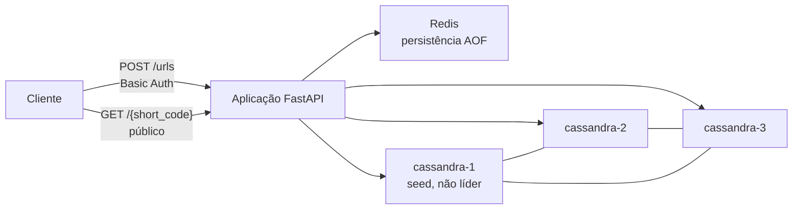
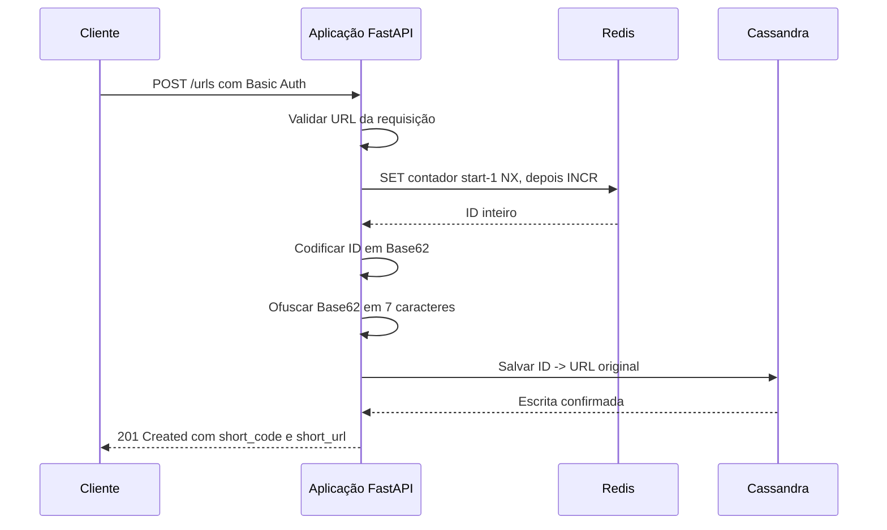
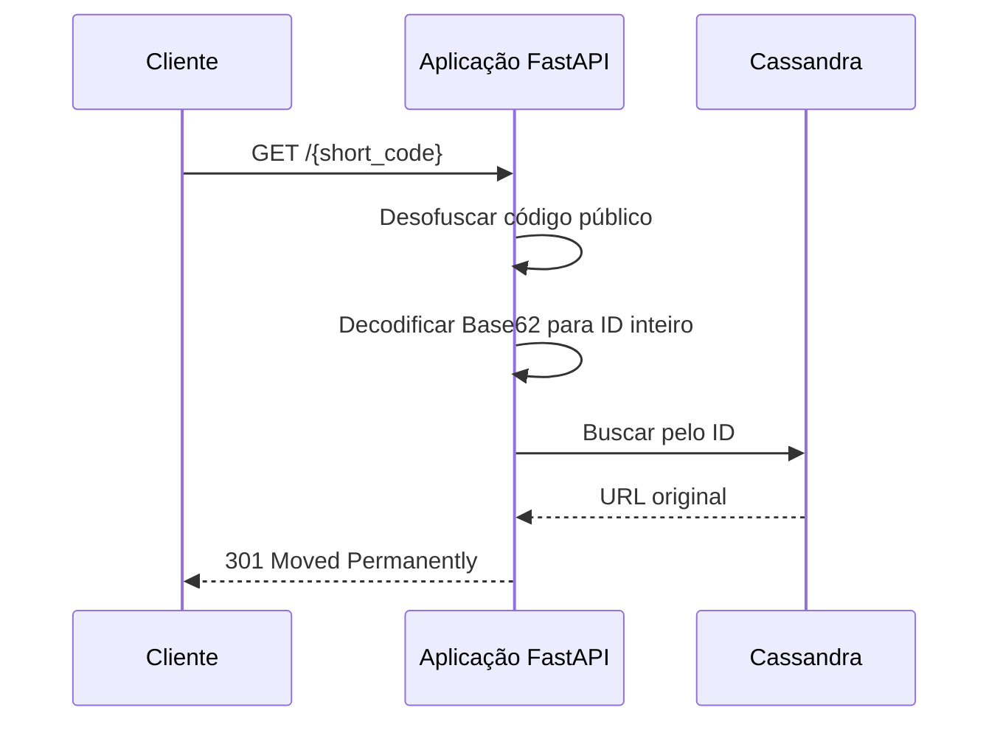

# Arquitetura

[English](../en/architecture.md) | [Português](architecture.md)

## Propósito

`url-shortener` é um projeto backend de portfólio com foco em desenho de sistemas. Ele implementa um encurtador de URLs com criação autenticada, resolução pública, geração de IDs no Redis, persistência no Cassandra, codificação Base62 e ofuscação reversível do código público.

A arquitetura evita camadas desnecessárias para que o comportamento do sistema seja direto de explicar em uma entrevista técnica.

## Componentes em Execução


```mermaid
flowchart LR
    client["Cliente"]
    app["Aplicação FastAPI"]
    redis["Redis<br/>persistência AOF"]
    c1["cassandra-1<br/>seed, não líder"]
    c2["cassandra-2"]
    c3["cassandra-3"]

    client -->|"POST /urls<br/>Basic Auth"| app
    client -->|"GET /{short_code}<br/>público"| app

    app --> redis
    app --> c1
    app --> c2
    app --> c3

    c1 --- c2
    c2 --- c3
    c1 --- c3
```

Componentes implementados:

- Aplicação FastAPI servida por Uvicorn.
- Organização em rota, controller e serviço.
- Basic Authentication em nível de rota para `POST /urls`.
- Rota pública `GET /{short_code}`, sem dependência de autenticação.
- Cliente Redis reaproveitado pelo lifespan do FastAPI.
- Cluster/session Cassandra reaproveitados pelo lifespan do FastAPI.
- Gerador de IDs Redis usando `SET ... NX` para inicialização não destrutiva e `INCR` para IDs atômicos.
- Store Cassandra usando a tabela `urls_by_id`.
- Ambiente Docker Compose com um Redis e três nós Cassandra.
- Bootstrap Cassandra idempotente para role, keyspace e tabela de URLs.

## Fluxo do POST


```mermaid
sequenceDiagram
    participant Cliente
    participant App as Aplicação FastAPI
    participant Redis
    participant Cassandra

    Cliente->>App: POST /urls com Basic Auth
    App->>App: Validar URL da requisição
    App->>Redis: SET contador start-1 NX, depois INCR
    Redis-->>App: ID inteiro
    App->>App: Codificar ID em Base62
    App->>App: Ofuscar Base62 em 7 caracteres
    App->>Cassandra: Salvar ID -> URL original
    Cassandra-->>App: Escrita confirmada
    App-->>Cliente: 201 Created com short_code e short_url
```

`POST /urls` exige `BASIC_AUTH_USERNAME` e `BASIC_AUTH_PASSWORD`. A autenticação usa `HTTPBasic` do FastAPI e comparação em tempo constante com `secrets.compare_digest`.

O corpo da resposta é:

```json
{
  "short_code": "<código-de-7-caracteres>",
  "short_url": "<SHORT_URL_BASE>/<código-de-7-caracteres>"
}
```

Cada POST válido cria um novo ID. A implementação não faz deduplicação de URLs e não define expiração ou TTL.

## Fluxo do GET


```mermaid
sequenceDiagram
    participant Cliente
    participant App as Aplicação FastAPI
    participant Cassandra

    Cliente->>App: GET /{short_code}
    App->>App: Desofuscar código público
    App->>App: Decodificar Base62 para ID inteiro
    App->>Cassandra: Buscar pelo ID
    Cassandra-->>App: URL original
    App-->>Cliente: 301 Moved Permanently
```

`GET /{short_code}` é público de propósito. Ele deve funcionar sem usuário, senha ou header `Authorization`. Em caso de sucesso, a resposta usa `301 Moved Permanently` com a URL original no header `Location`.

Um `301` comunica redirecionamento permanente e pode ser cacheado de forma agressiva por navegadores e outros clientes. Por isso, trocar o destino de um código já emitido não é um comportamento suportado de forma confiável.

Códigos malformados ou desconhecidos retornam `404 Not Found`. Falhas de consulta no Cassandra retornam `503 Service Unavailable`.

## Geração de IDs no Redis

O Redis é responsável por gerar IDs inteiros de forma atômica.

O primeiro ID gerado deve ser:

```text
62^4 = 14.776.336
```

O contador Redis é inicializado com:

```text
14.776.335
```

Assim, o primeiro `INCR` retorna `14.776.336`, que codifica para `10000` com o alfabeto Base62 configurado.

A inicialização usa `SET contador start-1 NX`, então um contador já persistido não é sobrescrito. O gerador inicializa uma vez por instância da aplicação e depois usa `INCR` a cada nova URL.

O Redis está com AOF habilitado e `appendfsync everysec`. AOF é um mecanismo de durabilidade, não de alta disponibilidade. Ele não fornece failover. Se o Redis perder estado já confirmado do contador enquanto o Cassandra mantiver linhas gravadas com IDs maiores, reutilização de ID pode se tornar um problema de corretude.

## Base62 e Ofuscação

Base62 usa o alfabeto:

```text
0123456789ABCDEFGHIJKLMNOPQRSTUVWXYZabcdefghijklmnopqrstuvwxyz
```

A propriedade essencial é:

```text
decode_base62(encode_base62(value)) == value
```

Antes de expor o código publicamente, o valor Base62 passa por uma ofuscação reversível e vira exatamente sete caracteres Base62. A operação inversa recupera o valor Base62 original:

```text
deobfuscate_base62(obfuscate_base62(value)) == value
```

A chave de ofuscação vem de `OBFUSCATING_KEY`. Ela não deve ser commitada nem documentada com valor real. Essa camada esconde IDs sequenciais nas URLs públicas, mas é ofuscação, não criptografia forte.

O espaço de códigos públicos é:

```text
62^7 = 3.521.614.606.208
```

## Persistência no Cassandra

O Cassandra armazena o modelo de consulta necessário para a aplicação:

```text
ID inteiro -> URL original
```

A tabela é:

```sql
CREATE TABLE IF NOT EXISTS urls_by_id (
    id bigint PRIMARY KEY,
    original_url text
);
```

Para resolver um código público, a aplicação desfaz a ofuscação, decodifica o Base62 para o ID inteiro e consulta o Cassandra pela chave primária.

O cluster local tem três nós peer-to-peer:

- `cassandra-1`
- `cassandra-2`
- `cassandra-3`

`cassandra-1` é o seed node para descoberta. Ele não é líder, primary, master, fonte única de verdade ou coordenador permanente. Qualquer nó Cassandra apropriado pode coordenar uma requisição.

O keyspace configurado usa `NetworkTopologyStrategy` com fator de replicação 3 em `datacenter1`. Com três nós locais e RF=3, cada linha é replicada para os três nós desse datacenter.

## Ciclo de Vida das Conexões

O lifespan do FastAPI cria recursos reutilizáveis no startup:

- um cliente Redis;
- um gerador de IDs Redis;
- um par cluster/session Cassandra;
- um store Cassandra de URLs.

No shutdown, o lifespan fecha os recursos Redis e Cassandra. A aplicação não cria uma conexão Redis ou uma session Cassandra nova a cada requisição.

O Docker Compose usa health checks e dependências entre serviços para prontidão. O startup não depende de sleeps arbitrários.

## Tratamento de Falhas

As falhas esperadas são tratadas explicitamente:

- entrada inválida no POST: erro de validação FastAPI/Pydantic;
- credenciais ausentes ou inválidas no POST: `401 Unauthorized` com `WWW-Authenticate: Basic`;
- código curto desconhecido ou malformado: `404 Not Found`;
- falha na geração de ID no Redis: `503 Service Unavailable`;
- falha de persistência ou consulta no Cassandra: `503 Service Unavailable`;
- configuração obrigatória ausente para encurtamento: `500 Internal Server Error`.

As respostas para clientes não expõem credenciais, hostnames internos, detalhes de topologia, stack traces ou valores secretos de configuração.

## Estratégia de Testes

A suíte padrão usa fakes para os comportamentos de Redis e Cassandra, mantendo os testes unitários e de API determinísticos e rápidos. Ela cobre:

- autenticação HTTP e comportamento do redirecionamento público;
- pipeline de criação e resolução de URLs;
- inicialização e incremento do contador Redis;
- comportamento do store Cassandra;
- codificação/decodificação Base62;
- ofuscação reversível.

O comportamento com Redis e Cassandra reais é validado por configuração Docker Compose e verificações manuais ou de integração, não por todos os testes unitários padrão.

## Decisões de Arquitetura e Trade-offs

### Escopo e evidências

**Implementado:** criação/resolução síncronas, clientes reutilizáveis, contador Redis, mappings Cassandra por chave, obfuscação determinística, Basic Auth e testes com fakes. **Projetado / preparado arquiteturalmente:** instâncias podem compartilhar stores, mas não há deploy multi-instância ou failover. **Planejado / trabalho futuro:** testes reais de dependências/falhas, capacidade medida, recuperação/HA, controle de abuso e operação de produção. São candidatos a revisão, não funcionalidades entregues.

O guia URL Shortener do Technical Interview sustenta a intenção de aprendizado (Python e persistência distribuída). Código prevalece. Alternativas são comparações de engenharia, não alegações de protótipos históricos.

### Decisão: Python/FastAPI com chamadas síncronas

**Contexto e decisão.** A carga coordena validação e dois stores, sem computação pesada. Python atende ao objetivo de aprendizado; FastAPI fornece Pydantic `HttpUrl`, OpenAPI e dependências de autenticação. Rotas `def` comuns fazem chamadas Redis/Cassandra síncronas por workers em threads do framework; lifespan `async` não torna operações de banco assíncronas.

**Justificativa e alternativas.** Route → controller → service → infrastructure separa erros HTTP, orquestração e acesso a dados. Unir route/service reduz arquivos; drivers async evitam ocupar threads durante I/O, mas exigem compatibilidade/justificativa medida. Go/Java poderiam oferecer os mesmos contratos com outras ferramentas.

**Trade-offs e consequências.** Serviço importa infraestrutura concreta e schemas Pydantic; helpers leem settings globais em cache em vez dos settings injetados. Há pontos de substituição por fakes, não Clean Architecture estrita. Stores lentos ocupam workers. Lifespan reutiliza/fecha clientes, mas startup conecta Cassandra e cria a tabela antes de atender.

**Reavaliar quando.** Testes de carga mostrarem saturação, múltiplos adaptadores forem necessários ou configuração global dificultar isolamento.

**Evidências:** [rotas](../../app/api/routes.py), [controller](../../app/controllers/url_controller.py), [serviço](../../app/services/url_service.py), [lifespan](../../app/main.py), [schemas](../../app/schemas.py).

### Decisão: IDs atômicos Redis separados dos mappings persistentes

**Contexto e decisão.** Escritas concorrentes precisam de inteiros distintos antes dos códigos. `SET ... NX` inicializa `start - 1` sem resetar contador existente; `INCR` aloca atomicamente entre instâncias que compartilham a chave Redis. Lock de processo protege inicialização local, não alocação distribuída. Começar em `62^4` produz `10000` no alfabeto padrão, não é requisito fundamental de encurtadores.

**Justificativa e alternativas.** Primitiva atômica evita corrida de leitura/alteração/escrita. Sequência relacional junto do mapping elimina coordenação entre stores. Códigos aleatórios precisam de colisão/retry; IDs distribuídos/blocos exigem outro modelo de recuperação. Cassandra `MAX(id)+1` não é alocador concorrente seguro.

**Trade-offs e consequências.** Redis não é fila nem cache de redirect. Uma instância centraliza criação, sem failover. AOF `everysec` melhora persistência, sem garantir todo incremento reconhecido. Falha Cassandra após alocação pode deixar gap aceitável. Timeout pode tornar persistência incerta; retry não é idempotente e cria outro ID. Rollback/reinicialização do contador pode reutilizar chave Cassandra; `INSERT` comum é upsert sem proteção condicional contra colisão. Recuperação afeta correção, não apenas disponibilidade. Redirects existentes não chamam Redis, embora uma aplicação iniciando dependa de sua configuração de startup.

**Reavaliar quando.** Unicidade após recuperação, disponibilidade de escrita ou carga de alocação forem requisitos de produção. Coordenar restauração dos dois stores antes de liberar escritas.

**Evidências:** [gerador](../../app/infrastructure/redis_id_generator.py), [store](../../app/infrastructure/cassandra_url_store.py), [AOF](../../compose.yaml), [testes](../../tests/test_redis_id_generator.py).

### Decisão: Cassandra por chave primária para estudar persistência distribuída

**Contexto e decisão.** Resolução conhece um ID e precisa de uma URL. `id bigint PRIMARY KEY` faz cada ID ser partition key, sem clustering columns, joins, índice por URL original, TTL ou deduplicação. Particionamento usa o partitioner Cassandra; inteiros sequenciais não formam uma partição única de contador nesta tabela.

**Justificativa e alternativas.** O guia de entrevista apresenta Cassandra como escolha de aprendizado distribuído. PostgreSQL ou store chave/valor durável único simplificariam uma implantação pequena. Não há tráfego medido que exija Cassandra.

**Trade-offs e consequências.** Bootstrap configura NetworkTopologyStrategy, RF=3 no datacenter escolhido. Três nós locais demonstram replicação, não isolamento físico de falhas. Seed descobre cluster, não lidera. `DCAwareRoundRobinPolicy` prefere o datacenter configurado. Execution profile **não** define consistência explícita de leitura/escrita; depende dos defaults do driver fixado. RF=3 sozinho não estabelece garantia própria de leitura após escrita. Quorum explícito troca mais confirmações de réplicas por latência/disponibilidade em falhas; não está configurado. Sem benchmark/capacidade de produção alegados.

**Reavaliar quando.** Garantias de leitura após criação, topologia, custo operacional ou acessos mudarem. Definir/testar consistência, partições e perda de nós antes de alegar disponibilidade.

**Evidências:** [store/profile](../../app/infrastructure/cassandra_url_store.py), [bootstrap](../../docker/cassandra/bootstrap.sh), [lockfile](../../uv.lock), [topologia](../../compose.yaml).

### Decisão: Códigos reversíveis de sete caracteres sem chave pública persistida separada

**Contexto e decisão.** ID vira Base62 e passa por `(a * id + b) mod 62^7`; `a` derivado da chave é coprimo ao módulo, permitindo inversa modular. Resolução reverte a transformação e consulta o inteiro sem segundo índice.

**Justificativa e alternativas.** Para IDs únicos no domínio suportado, chave fixa e alfabeto padrão, a permutação evita colisões aleatórias e oculta a sequência evidente. Base62 direto simplifica mas expõe sequência. Chaves públicas aleatórias persistidas desacoplam links da configuração reversível, com custo de unicidade. Construções criptográficas revisadas seriam adequadas se imprevisibilidade fosse requisito de segurança.

**Trade-offs e consequências.** É obfuscação, não criptografia/controle de acesso. `62^7` é domínio matemático, não capacidade medida; alocação começa acima de zero e rejeita IDs além do domínio. Mudar chave/alfabeto altera resolução de links já emitidos, sem versão armazenada. Validação do alfabeto verifica apenas tamanho/unicidade; padding usa `0` fixo, exigindo cuidado com alfabetos arbitrários. Instâncias precisam de configuração estável compartilhada.

**Reavaliar quando.** Rotação de chave, domínio maior, imprevisibilidade criptográfica ou alfabeto arbitrário forem necessários. Preservar versões antigas de decode ou migrar para IDs públicos persistidos.

**Evidências:** [Base62](../../app/helpers/base62.py), [obfuscação](../../app/helpers/obfuscation.py), [testes](../../tests/test_obfuscation.py).

### Decisão: Criação autenticada e redirects públicos permanentes

**Contexto e decisão.** Criar altera estado; compartilhar link não deve exigir conta do destinatário. POST usa um par Basic Auth configurado, comparações em tempo constante. GET retorna `301`; inválido/desconhecido compartilham 404, falhas esperadas de dependências geram 503 genérico.

**Justificativa e alternativas.** Contrato pequeno sem contas persistidas. Tokens por usuário permitem propriedade/quotas com maior complexidade. Redirect temporário favorece destinos editáveis.

**Trade-offs e consequências.** Basic Auth precisa de TLS fora de loopback; sem usuários/papéis/revogação individual/rate limit. `HttpUrl` valida sintaxe HTTP(S), não segurança do destino/anti-phishing; backend não busca o destino. Códigos públicos não são links privados. Cache de 301 dificulta edição, enforcement de exclusão e analytics completo. Configuração auth/codec ausente causa 500. Timeout/retry não têm idempotência.

**Reavaliar quando.** Links editáveis, propriedade, analytics ou exposição pública exigirem controle de abuso. Definir caching/auth antes.

**Evidências:** [segurança](../../app/core/security.py), [controller](../../app/controllers/url_controller.py), [testes HTTP](../../tests/test_http.py).

### Decisão: Cluster Docker local e testes rápidos com limites operacionais explícitos

**Contexto e decisão.** Compose executa app, Redis, três Cassandra e bootstrap. Reload/mounts suportam dev; loopback restringe exposição no host; app não-root. Lock uv congelado reproduz dependências. Fakes testam HTTP/helpers/comandos de contador/store sem cluster.

**Justificativa e alternativas.** Três nós permitem inspecionar replicação com mais recursos que um. Fakes isolam contratos; testes efêmeros reais validariam consistência/persistência/falhas ao custo de startup. Produção multi-host é requisito diferente de Compose local.

**Trade-offs e consequências.** Bootstrap é repetível mas escreve: pode alterar senhas/privilégios e replicação de keyspaces, inclusive `system_auth`. Papel da aplicação é SUPERUSER; health checks podem usar credenciais padrão Cassandra. Startup também executa `CREATE TABLE IF NOT EXISTS`. Não é provisionamento de produção com privilégio mínimo. Health da app busca OpenAPI, não probe do caminho real dos dados. Fakes não validam concorrência Redis real, repair, failover ou recuperação. Não há pipeline CI de deploy versionado.

**Reavaliar quando.** Produção/recuperação confiável forem necessárias: separar provisionamento privilegiado das credenciais runtime, definir health/readiness e testar dependências/falhas reais. Cache/broker precisam de requisito de carga/entrega.

**Evidências:** [Compose](../../compose.yaml), [Dockerfile](../../docker/Dockerfile), [bootstrap](../../docker/cassandra/bootstrap.sh), [health](../../docker/cassandra/healthcheck.sh), [guia de testes](testing.md).

### Verificação da revisão documental — 2026-10-05

Os 82 testes existentes passaram em container descartável `url-shortener-app:local`, com app/testes atuais somente leitura e `uv run --frozen pytest -p no:cacheprovider`. Tentativa offline não encontrou dependência de teste fixada; downloads permitiram executar. Testes usaram fakes/settings isolados, não Redis/Cassandra reais. Lifespan/stack Compose não foram iniciados porque bootstrap escreve configuração de roles/schema. Sem mount de diretórios de banco ou `.env` local. Containers removidos; sem alegação de verificação real de cluster/failover.

## Limitações verificadas no código — 2026-10-09

Helpers usam configuração global em cache mesmo quando o serviço recebe Settings injetado. `obfuscate_base62` preenche com `0` literal; a validação do alfabeto só exige 62 caracteres únicos. O padrão começa em 0; um alfabeto com outro dígito zero pode decodificar códigos preenchidos incorretamente (ou gerar caractere inválido se não contiver 0). Mantenha chave/alfabeto existentes estáveis; suporte arbitrário não é garantia verificada. Achado documentado, sem corrigir código.

`RedisIdGenerator` lembra a inicialização em memória e não reconsulta o contador depois. Perder/excluir a chave com o processo já inicializado pula start-1; INCR posterior pode reiniciar abaixo da faixa configurada. É risco de reutilização/recuperação, distinto de lacunas após falha Cassandra. Fakes cobrem inicialização/erros, não esse cenário nem concorrência real. Nenhum teste ou serviço foi executado nesta auditoria.
